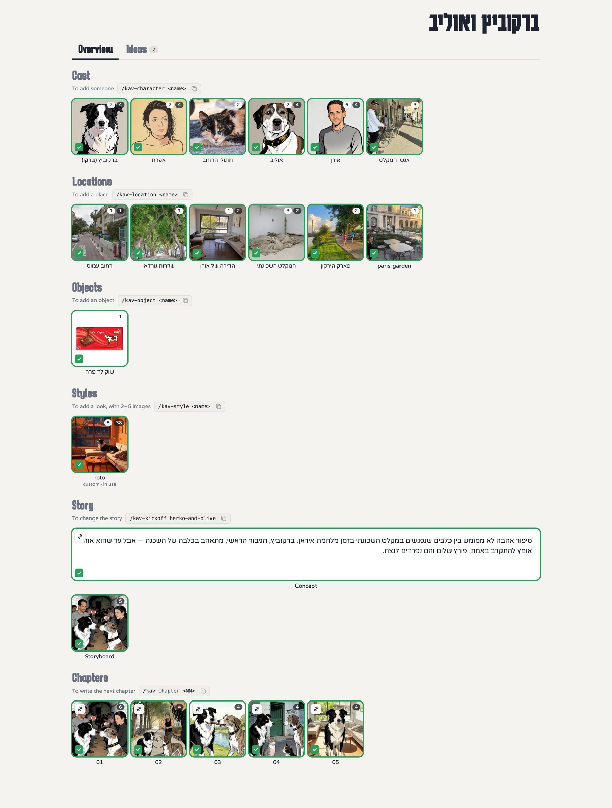
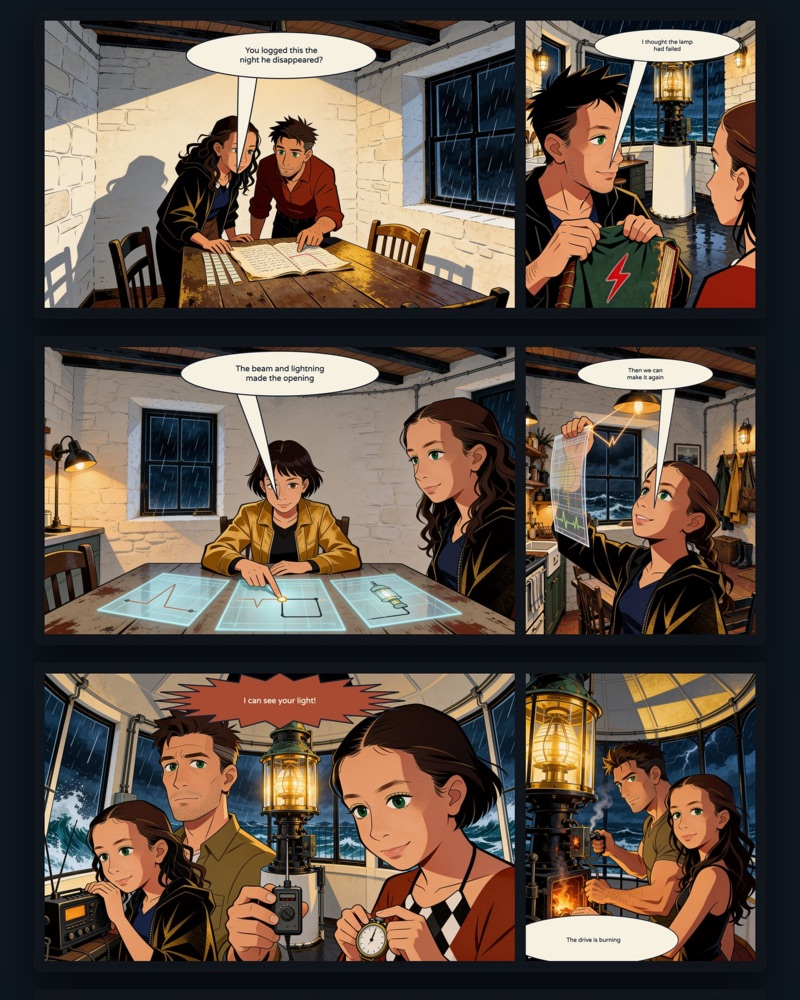
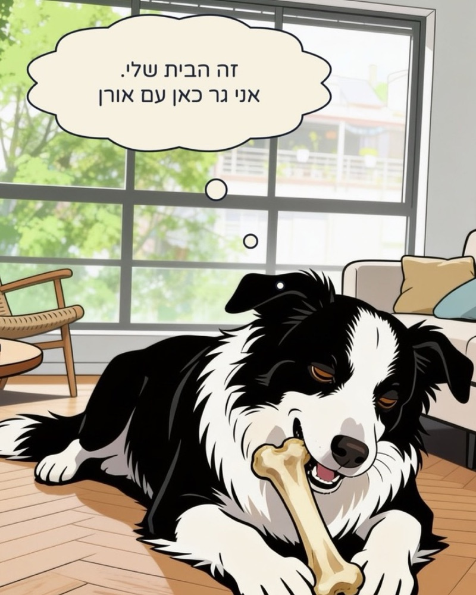
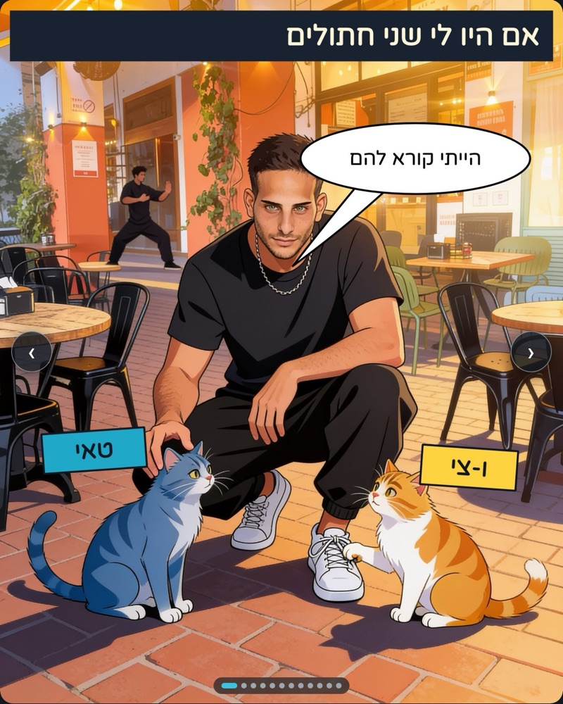

# Kav — Your AI co-writer for graphic novels

**[About](#about) · [Install](#install) · [Samples](#samples) · [Kav commands](#commands)**

## About

Kav is an AI co-writer for graphic novels (aka comic books).
Install it in your favorite AI tool (Claude Code or ChatGPT Codex) and the tool learns new skills, so the two of you can work on a story from the first concept to a finished book. There is no other app to install and nothing new to learn: everything happens in the chat. Sometimes Kav opens a web page to show you things, like when you compare visual styles, but mostly you chat as you normally would, only now with an expert in building graphic novels 🤓

With Kav, you control the division of work. Kav can brainstorm with you, test and flesh out story details, illustrate and write panels, and complete whole chapters. It can also follow your lead and take care of the grunt work. Think of Kav as a loyal apprentice: always helpful, never presumptuous or distracting.
It complements you, so you can focus on what you love and care about 💪🏽❤️

Here are some of the things you can do with Kav:

- **Ideate:** Take a story from a one-liner all the way to a fleshed-out storyboard. Develop characters and story arcs that move people.
- **Define a visual style:** Define, try out and iterate on visual styles. Blend different influences (say, the drawing style of *The Incal* with the composition of Alan Moore's *From Hell*), or supply your own style references for Kav to adapt.
- **Characters and locations:** Give Kav your photos of people, places or objects, and it turns them into references that keep the artwork consistent and recognizable. A comic book about your friends and favorite places.
- **Build chapters and panels:** Break your story into chapters, then illustrate and write them with Kav, one panel at a time.
- **Produce and publish:** Kav assembles your finished work as comic pages or as a swipeable one-panel-at-a-time view (perfect for Instagram!), and prepares Instagram-ready images for you to post.

[](docs/tour.md)

The **Story Tool** above is where your story lives while you work on it: cast, places, the look, your loose ideas and the chapter-by-chapter storyboard on one page. [Take the tour](docs/tour.md) to see each part.

## Install

Open Claude Code or Codex in an empty folder and paste:

```
Please read github.com/oraboy/kav, install it and help me get started.
```

This installs the skills and instruction files your AI needs to work as Kav. It also sets up image generation, so Kav can draw panels for you. Kav works with fal.ai (recommended), Google Gemini and Magnific; Higgsfield is supported but untested. If you already have an account with one of them, Kav uses it. If you don't, it walks you through getting one.

To start your first story, type `/kav-kickoff <code-name>`. For ideas on what to make, see the [samples](#samples).

> **Note:** Kav needs an agentic coding tool. Claude Code and OpenAI Codex are supported; Cursor, Gemini CLI / Antigravity and other tools that read `AGENTS.md` should work. It does **not** work in chat-only interfaces. If you have the Claude or ChatGPT desktop app, you already have one of these tools: open Claude Code or Codex there and start a new session (ask your chat for help if you get stuck). Manual steps are in [INSTALL.md](INSTALL.md).

> **Note:** Everything you make, from reference photos to finished panels, is stored in the `stories/<story-name>/` folder inside your Kav folder, where you can use it, back it up or copy it.

## Samples

<table>
<tr>
<td width="33%" align="center" valign="top">
<a href="https://last-light-oren-review.oraboy.chatgpt.site/"></a>
<br><b><a href="https://last-light-oren-review.oraboy.chatgpt.site/">The Last Light</a></b>
<br>A wild story about a lighthouse, a girl and a lost boy.
<br>[English]
</td>
<td width="33%" align="center" valign="top">
<a href="https://claude.ai/code/artifact/f69c71ef-8b2e-4fcb-96ab-f6d517cffbc9"></a>
<br><b><a href="https://claude.ai/code/artifact/f69c71ef-8b2e-4fcb-96ab-f6d517cffbc9">Berkovitz and Olive</a></b>
<div dir="rtl">סיפור אהבה תל-אביבי בזמן מלחמת איראן</div>
[Hebrew] [עברית]
</td>
<td width="33%" align="center" valign="top">
<a href="https://if-i-had-cats.oraboy.chatgpt.site"></a>
<br><b><a href="https://if-i-had-cats.oraboy.chatgpt.site">If I Had Cats</a></b>
<div dir="rtl">פיד מתגלגל של הצעות לשמות של חתולים עירוניים. למי שצריך 🐈🐈‍⬛</div>
[Hebrew] [עברית]
</td>
</tr>
</table>

Every chapter comes out in two views: comic pages, like *The Last Light* above, and one panel at a time on a phone, like *Berkovitz and Olive*. [The tour](docs/tour.md#sample-stories) shows both views of each story.

## The process

Kav roughly follows this process, but it adapts to your way of working too. Tell it what you want to do.

1. **Kickoff** — a slug and a one-line pitch
2. **Characters, locations, key events** — collected one at a time, with reference images
3. **Visual style** — pick or build a style pack, test it cheaply, lock it
4. **Storyboard & brief** — story shape, intention/obstacle per character, a card per chapter, a one-page brief
5. **Chapter by chapter** — an outline, the scene breakdown, image review on a local page
6. **Lettering & pages** — captions, balloons and sound bursts; pages, a phone reader and a page reader
7. **Final draft & publish** — linked readers, Instagram-ready carousel images, a trailer deck

Details: [docs/process.md](docs/process.md).

## Commands

| Claude Code | Codex CLI | What it does |
|---|---|---|
| `/kav-start` | `/prompts:kav-start` | welcome, install health check, image setup with a test panel |
| `/kav-kickoff <slug>` | `/prompts:kav-kickoff <slug>` | scaffold a story: concept, cast, locations, style, pitch, storyboard, brief |
| `/kav-character <name>` | `/prompts:kav-character <name>` | build a character's reference mug shots |
| `/kav-style <pack>` | `/prompts:kav-style <pack>` | register reference images as a named style |
| `/kav-visual-style-lock <pack>` | `/prompts:kav-visual-style-lock <pack>` | test the style on cheap samples, then bake production references |
| `/kav-note <note>` | `/prompts:kav-note <note>` | jot down any idea — a scene, a visual, an object — for Kav to pick up when it fits |
| `/kav-view [ideas]` | `/prompts:kav-view [ideas]` | pull up the Story Tool, fresh |
| `/kav-chapter <NN>` | `/prompts:kav-chapter <NN>` | write and draw one chapter |
| `/kav-location <name>` | `/prompts:kav-location <name>` | bring a place into the story from its photos |
| `/kav-object <name>` | `/prompts:kav-object <name>` | bring a thing that must always look the same (a can, a car, a dress) into the story |
| `/kav-coldread [NN]` | `/prompts:kav-coldread [NN]` | read it back the way a first-time reader does, and say what isn't landing |
| `/kav-panel` | `/prompts:kav-panel` | one scene plus its text into a lettered panel |
| `/kav-review <batch.json>` | `/prompts:kav-review <batch.json>` | open the image review page and apply your picks |
| `/kav-trailer` | `/prompts:kav-trailer` | build the story's swipeable trailer deck |
| `/kav-publish` | `/prompts:kav-publish` | build and link readers for every chapter; where to post them |

In Codex, custom prompts are invoked with the `/prompts:` prefix. In any other agent, ask for the step in plain words ("start a kickoff for my story") — the agent routes it through `AGENTS.md`.

## Requirements

- **Claude Code** or **ChatGPT Codex** (either CLI or desktop app)
- **Python 3.10+** and the packages in `requirements.txt`
- **Google Chrome or Chromium**, which Kav uses behind the scenes to letter panels and assemble pages
- **An account with one image provider** (fal.ai recommended). Images are the only cost beyond your AI subscription: about $0.04 each on fal.ai, so around $4 for a 25-panel chapter with retakes

The install checks each of these and tells you what is missing.

## Folder layout

```
AGENTS.md              operating contract for any agent
kav/commands/          the canonical commands (tool-agnostic markdown)
.claude/skills/        Claude Code adapters (generated)
adapters/codex/        Codex CLI prompts and skills (generated)
docs/                  process, craft, know-how, templates, publishing
tools/                 image generation, review page, lettering, pages, readers, trailer
styles/                shared style packs
stories/<slug>/        your stories: cast, locations, style, storyboard, chapters, package
```

## License

MIT — see [LICENSE](LICENSE).
