# A tour of Kav

Two things to see before you install: the Story Tool, where your story lives while you work on it, and a few stories that were made with Kav.

The Story Tool screenshots below come from one real book, *Berkovitz and Olive*, a five-chapter love story between two dogs who meet in a Tel Aviv bomb shelter. The book is in Hebrew, so names and text in the screenshots are too. Kav works in any language and letters right-to-left as well as left-to-right.

## The Story Tool

The Story Tool is one page that opens beside your chat when the first piece of your story lands, and it stays current after every change. Everything Kav knows about your story is on it: who is in it, where it happens, how it looks, and what happens chapter by chapter.

Each square is one piece of the story. A green check means the piece is ready to be drawn. The two small numbers count the reference images you gave and the images Kav made from them. Above each row is the command that adds to it, with a copy button.

### Cast, locations and objects

These are the building blocks. You bring each one in once, and from then on every panel that includes it draws from the same references, so a character looks like the same character on page 1 and page 40.

Click a square to open it. A character shows what Kav knows about them, the photos you gave, and the reference set Kav built in the book's style.

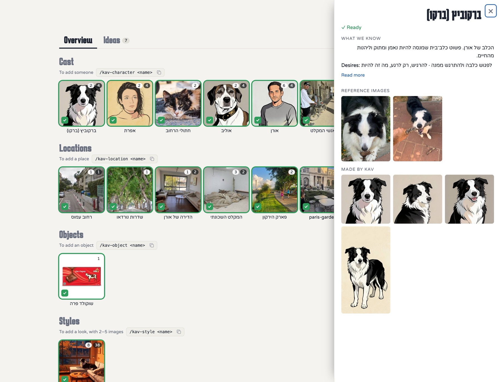

A place works the same way. Here one photo of a living room became two drawn views that later panels are set in.

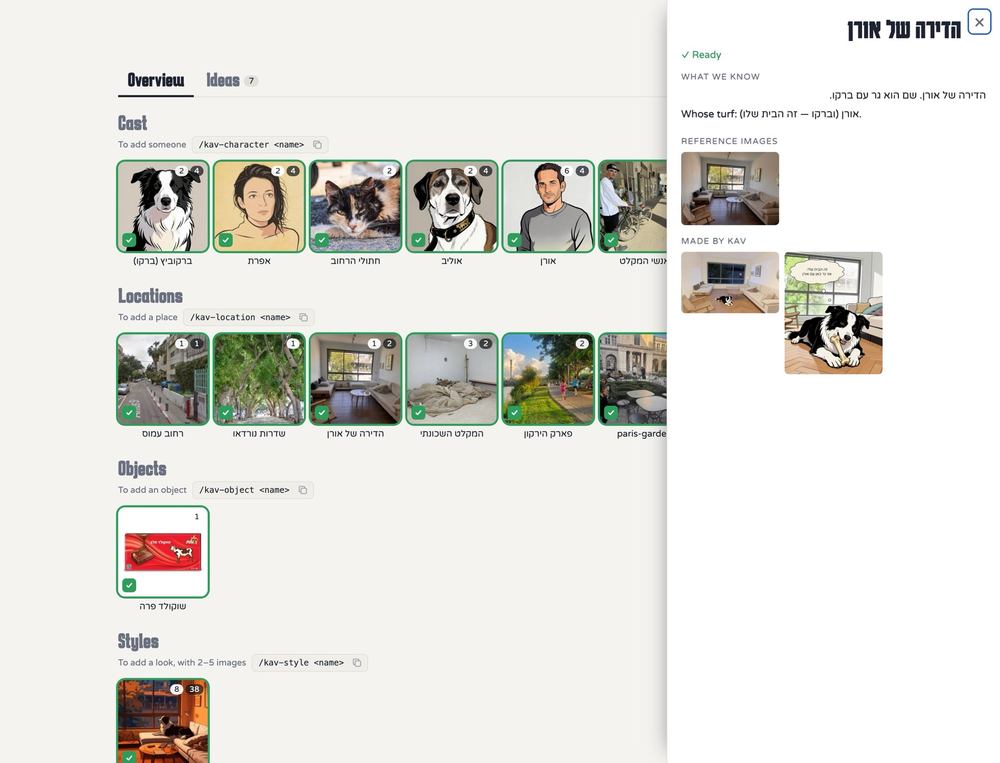

Objects are for things that must look the same every time they appear. In this book it is a bar of chocolate with a specific wrapper.

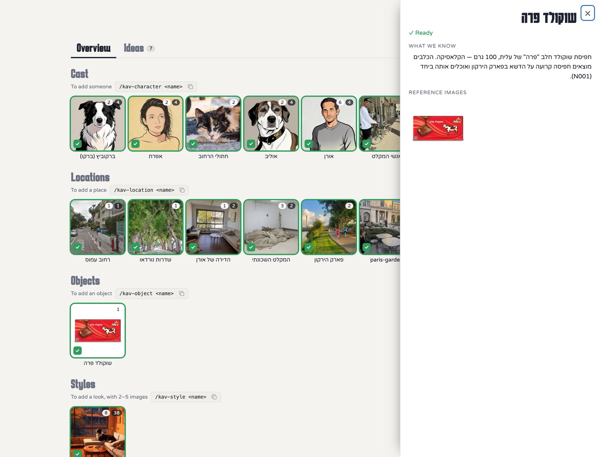

### Visual style

You pick a look by trying it, on your own characters, before any chapter is drawn. A style pack is a handful of reference images. Kav renders the same test scenes in each pack you are considering, with your cast and your locations, so you compare like with like.

This is one scene from the book in three packs. The third is the one the author locked.

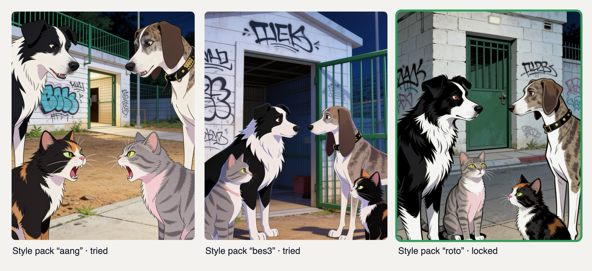

Once a style is locked, Kav rebuilds every character's reference set in that style and every later panel binds to it.

### Ideas

Ideas arrive out of order: a scene for the last chapter while you are still describing the first character, a running gag, a twist. The Ideas tab is where they go. Type `/kav-note` and the thought in the chat, or pin it on the board, and carry on with what you were doing.

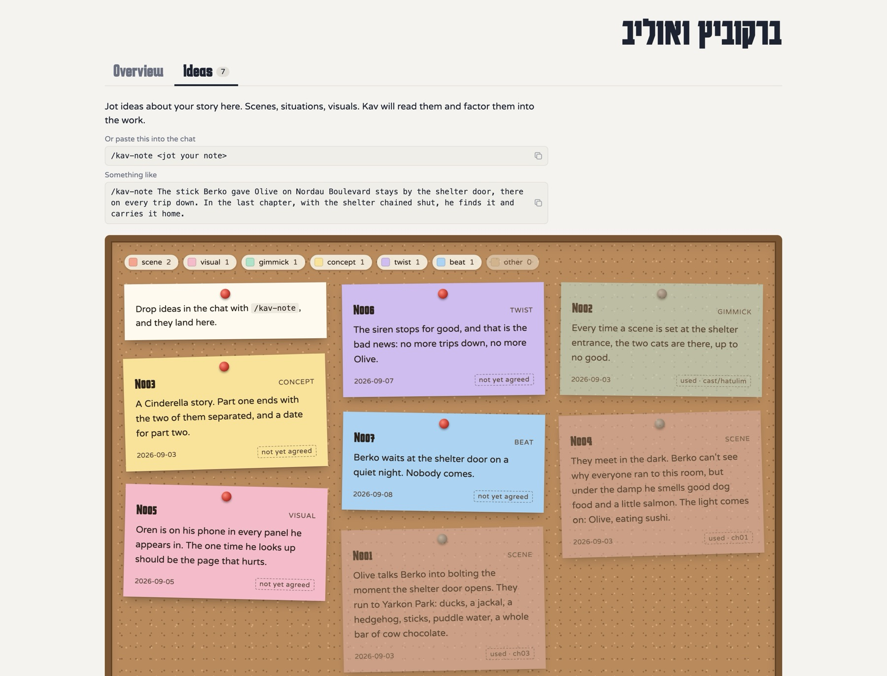

Kav reads the notes when it writes the pitch, the storyboard and each chapter, and brings up the ones that touch what you are working on. A note that made it into the story is greyed out and tagged with where it went, like the two here marked *used · ch01* and *used · ch03*. (The notes in this screenshot are English versions written for this tour.)

### Storyboard

The storyboard turns the idea into a sequence. It holds the shape of the whole story, what the main character wants and what stands in the way, and one card per chapter with a question, a synopsis and a piece of concept art.

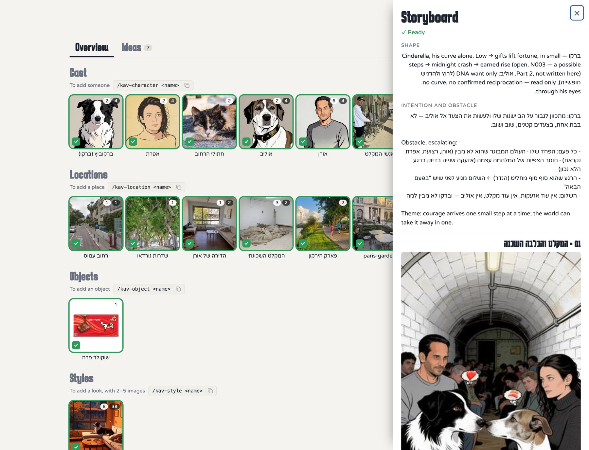

Each chapter then gets its own square. A finished chapter shows its assembled pages and two links: one to read it as comic pages, one to read it panel by panel on a phone.

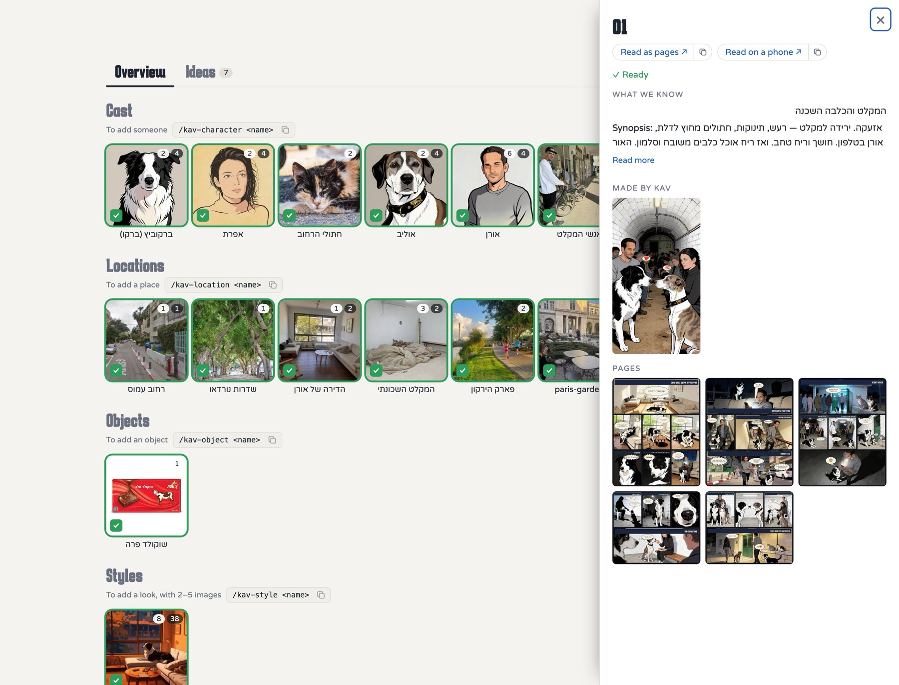

## Sample stories

Every chapter Kav finishes comes out in two forms. *Pages* is the comic layout, several panels to a page. *Phone* is one panel per screen, swiped through like a story.

### The Last Light

English · six chapters. A wild story about a lighthouse, a girl and a lost boy.

| Pages | Phone |
|---|---|
| 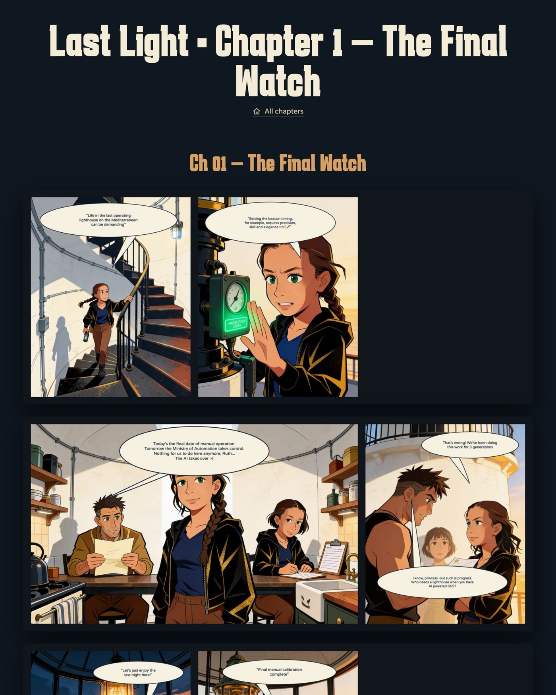 | 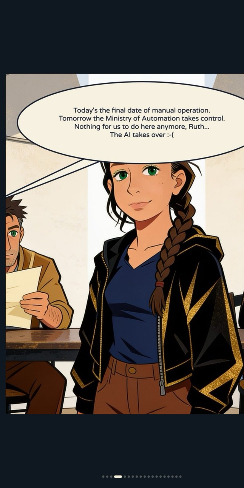 |

### Berkovitz and Olive (ברקוביץ ואוליב)

Hebrew · five chapters. A Tel Aviv love story during the Iran war.

סיפור אהבה תל-אביבי בזמן מלחמת איראן

| Pages | Phone |
|---|---|
| 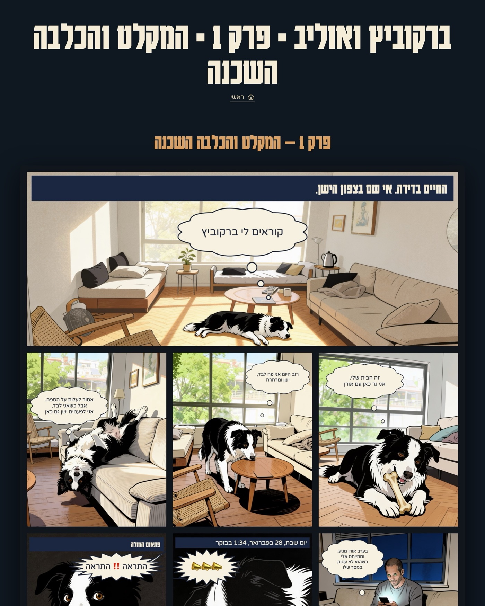 | 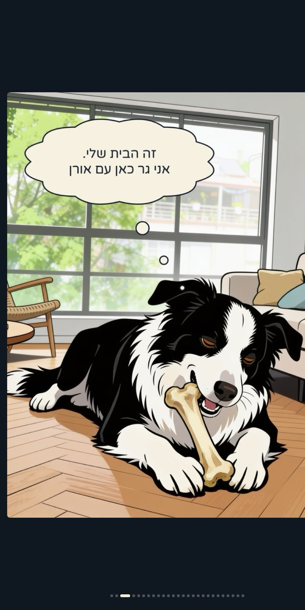 |

### If I Had Cats (אם היו לי חתולים)

Hebrew · an ongoing feed of single images, 12 so far: name suggestions for city cats, for whoever needs them.

פיד מתגלגל של הצעות לשמות של חתולים עירוניים. למי שצריך 🐈🐈‍⬛

[Read it](https://if-i-had-cats.oraboy.chatgpt.site)

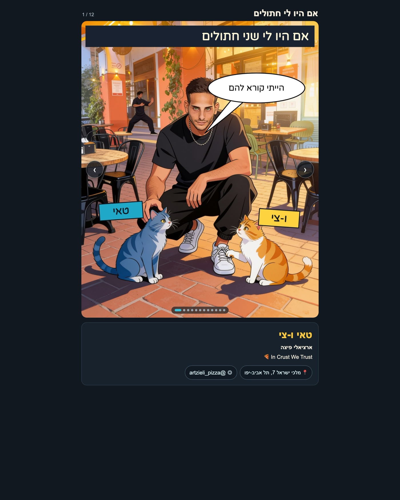

## Next

[Install Kav](../README.md#install), then run `/kav-start`. It checks the install, sets up image generation with one test panel, and offers to start your first story. A good first sitting is one character in one place.
